# 🌍 Multilingual Language Learning App
An intelligent language learning application with AI-powered Anki algorithm for personalized vocabulary training.

## 📖 About the Project
This app enables users to input sentences in their native language, categorize them by themes (e.g., "Arbeit", "Essen"), and have them translated into target languages using AI. An intelligent spaced repetition algorithm ensures optimal learning success through personalized review scheduling.

## 🎯 Key Features
- **Personalized Translations**: Users input sentences in their native language, assign a category, and receive AI-generated translations.
- **Thematic Organization**: Sentences can be tagged with categories (e.g., "Arbeit", "Essen") for targeted learning.
- **Intelligent Assessment**: AI evaluates similarity between user answers and correct translations.
- **Anki Algorithm**: AI-powered spaced repetition system for optimal review intervals.
- **Multilingual Support**: Simultaneous learning of multiple languages.
- **Progress Tracking**: Detailed learning statistics and progress monitoring.

## 🚀 Technology Stack
- **Backend**: Node.js/Express (or Python/FastAPI)
- **Database**: PostgreSQL
- **AI Integration**: Claude API (Anthropic)
- **API Documentation**: Swagger/OpenAPI
- **Testing**: REST API Endpoints via Postman/curl

## 🏗️ Project Architecture

### Database Schema
```
users (1:n) user_languages
users (1:n) sentences (1:n) translations (1:1) learning_progress
```

### Core Entities
- **Users**: User profiles with native language.
- **User_Languages**: Target languages per user.
- **Sentences**: Original input sentences with a category (e.g., "Arbeit", "Essen").
- **Translations**: AI-generated translations.
- **Learning_Progress**: Anki algorithm data and learning progress.

## 🔧 API Endpoints

### Sentences Management
```
POST /api/sentences                 # Input new sentence with category and generate translations
GET /api/sentences/{user_id}        # Retrieve all sentences for a user
GET /api/sentences/{user_id}/category/{category}  # Retrieve sentences by category
DELETE /api/sentences/{id}          # Delete sentence
```

### Learning System
```
POST /api/learn/{translation_id}    # Submit learning attempt and get AI evaluation
GET /api/review/due/{user_id}       # Get due cards for review
POST /api/review/schedule/{user_id} # Execute AI-powered Anki algorithm
```

### User Management
```
POST /api/users                     # Create new user
GET /api/users/{id}/languages       # Get learning languages
POST /api/users/{id}/languages      # Add new target language
GET /api/stats/{user_id}            # Get learning statistics
```

## 🤖 AI Integration

### 1. Translation Service
**Input**: German sentence with category  
**Output**: JSON with translations in all target languages
```json
{
  "translations": [
    {"language": "vi", "text": "Tôi đi làm", "confidence": 0.95, "category": "Arbeit"},
    {"language": "it", "text": "Vado al lavoro", "confidence": 0.98, "category": "Arbeit"}
  ]
}
```

### 2. Score Assessment
**Input**: User answer vs. correct translation  
**Output**: JSON with similarity score and feedback
```json
{
  "similarity_score": 85.5,
  "feedback": "Very good! Only missing the accent marks.",
  "improvement_tips": "Pay attention to Vietnamese diacritical marks"
}
```

### 3. Anki Algorithm
**Input**: Learning statistics of all user's cards  
**Output**: JSON with optimized review schedules
```json
{
  "cards": [
    {
      "translation_id": 1,
      "next_review": "2024-01-18",
      "priority": 7,
      "reason": "Score improving but needs reinforcement",
      "category": "Arbeit"
    }
  ]
}
```

## 📊 Example Workflow
1. **Setup**: User creates profile (German native, learning Vietnamese + Italian).
2. **Input**: User enters: "Ich fahre zur Arbeit" with category "Arbeit".
3. **AI Translation**: System generates "Tôi đi làm" (Vietnamese) and "Vado al lavoro" (Italian), tagged with "Arbeit".
4. **Learning**: User attempts translation, inputs "Toi di lam".
5. **AI Scoring**: AI evaluates with 85.5% similarity (missing accent marks).
6. **Anki Update**: Algorithm schedules next review in 2 days.
7. **Review**: AI suggests next due cards based on performance data, filterable by category (e.g., "Arbeit").

```mermaid
flowchart TD
    Start([Start]) --> A[User creates account]
    A --> B[User selects native language]
    B --> C[User chooses target languages]
    C --> D[Profile setup completed]
    D --> E{More sentences?}
    
    E -- Yes --> F[User inputs sentence in native language]
    F --> G[System stores sentence in database]
    G --> H[System calls translation API]
    H --> I{Fork}
    
    I --> J[AI translates to target language 1]
    I --> K[AI translates to target language 2]
    I --> L[AI translates to target language N]
    
    J --> M[Store translation 1 in database]
    K --> N[Store translation 2 in database]
    L --> O[Store translation N in database]
    
    M --> P[Create flashcards for all translations]
    N --> P
    O --> P
    
    P --> E
    
    E -- No --> Q[User starts learning session]
    Q --> R[System selects cards using Anki algorithm]
    R --> S{Session active?}
    
    S -- Yes --> T[Display flashcard to user]
    T --> U[User inputs answer]
    U --> V[Send to AI evaluation service]
    V --> W[AI compares with correct translation]
    W --> X[Calculate similarity score]
    X --> Y{Score ≥ 80%?}
    
    Y -- Yes --> Z[Mark card as known]
    Z --> AA[Increase repetition interval]
    AA --> AB[Award points to user]
    
    Y -- No --> AC[Mark card as unknown]
    AC --> AD[Decrease repetition interval]
    AD --> AE[Provide improvement feedback]
    
    AB --> AF[Update learning progress in database]
    AE --> AF
    AF --> S
    
    S -- No --> AG[Display session statistics]
    AG --> AH[End learning session]
    AH --> End([End])
``` 


## 🗄️ Database Structure


### MVP Schema
```sql
-- Users with native language
CREATE TABLE users (
    id SERIAL PRIMARY KEY,
    username VARCHAR(50) UNIQUE NOT NULL,
    native_language VARCHAR(5) NOT NULL,
    created_at TIMESTAMP DEFAULT NOW()
);

-- Target languages per user
CREATE TABLE user_languages (
    id SERIAL PRIMARY KEY,
    user_id INTEGER REFERENCES users(id),
    language_code VARCHAR(5) NOT NULL,
    UNIQUE(user_id, language_code),
    created_at TIMESTAMP DEFAULT NOW()
);

-- Original sentences with category
CREATE TABLE sentences (
    id SERIAL PRIMARY KEY,
    user_id INTEGER REFERENCES users(id),
    original_text TEXT NOT NULL,
    language_code VARCHAR(5) NOT NULL,
    category VARCHAR(50),  -- e.g., "Arbeit", "Essen"
    created_at TIMESTAMP DEFAULT NOW()
);

-- AI-generated translations
CREATE TABLE translations (
    id SERIAL PRIMARY KEY,
    sentence_id INTEGER REFERENCES sentences(id),
    translated_text TEXT NOT NULL,
    target_language VARCHAR(5) NOT NULL,
    translation_confidence DECIMAL(3,2),
    created_at TIMESTAMP DEFAULT NOW()
);

-- Anki learning progress
CREATE TABLE learning_progress (
    id SERIAL PRIMARY KEY,
    user_id INTEGER REFERENCES users(id),
    translation_id INTEGER REFERENCES translations(id),
    ease_factor DECIMAL(4,2) DEFAULT 2.50,
    interval_days INTEGER DEFAULT 1,
    repetitions INTEGER DEFAULT 0,
    last_score DECIMAL(4,2),
    next_review DATE DEFAULT CURRENT_DATE,
    UNIQUE(user_id, translation_id),
    created_at TIMESTAMP DEFAULT NOW()
);
```

## 🎯 Project Features
✅ **Fulfills All Requirements**
- ✅ **REST API with CRUD**: Complete Sentence/Translation/User management.
- ✅ **Database**: Multi-table PostgreSQL schema with category support.
- ✅ **LLM with JSON Output**: 3 different AI services with structured output.
- ✅ **More than GPT Wrapper**: Sophisticated Learning Analytics + Spaced Repetition System.

## 🚀 Extension Possibilities
- **Learning Sessions**: Detailed storage of every learning attempt for advanced analytics.
- **Difficulty Detection**: AI automatically recognizes sentence difficulty levels.
- **Audio Integration**: Text-to-speech for pronunciation practice.
- **Gamification**: Streak system and achievement badges.
- **Social Features**: Shared vocabulary sets between users.
- **Category Management**: Allow users to create custom categories or suggest categories via AI.

## 🔍 Testing
The API can be fully tested via Swagger UI or tools like Postman/curl:
```bash
# Create new user
curl -X POST http://localhost:3000/api/users \
  -H "Content-Type: application/json" \
  -d '{"username": "max", "native_language": "de"}'

# Input sentence with category and generate translations
curl -X POST http://localhost:3000/api/sentences \
  -H "Content-Type: application/json" \
  -d '{"user_id": 1, "text": "Ich fahre zur Arbeit", "category": "Arbeit"}'

# Retrieve sentences by category
curl -X GET http://localhost:3000/api/sentences/1/category/Arbeit

# Submit learning attempt
curl -X POST http://localhost:3000/api/learn/1 \
  -H "Content-Type: application/json" \
  -d '{"user_answer": "Toi di lam"}'
```

## 📈 Learning Objectives
This project demonstrates:
- **Backend Development**: RESTful API design and implementation.
- **Database Design**: Normalized relational database structure with category-based filtering.
- **AI Integration**: Structured LLM communication with JSON parsing.
- **Algorithmic Thinking**: Implementation of Anki spaced-repetition algorithm.
- **System Design**: Scalable and extensible software architecture.

## 🏃‍♂️ Getting Started
```bash
# Clone repository
git clone https://github.com/username/multilingual-learning-app.git

# Install dependencies
npm install  # or pip install -r requirements.txt

# Database setup
createdb language_learning_app
npm run migrate  # or python manage.py migrate

# Set environment variables
cp .env.example .env
# CLAUDE_API_KEY=your_api_key_here

# Start server
npm start  # or python app.py

# Open API documentation
open http://localhost:3000/api/docs
```

## 🧠 Technical Highlights

### AI-Powered Features
- **Dynamic Translation Quality**: Confidence scoring for translation accuracy.
- **Personalized Learning**: AI adapts review intervals based on individual performance.
- **Intelligent Feedback**: Context-aware error analysis and improvement suggestions.

### System Architecture
- **Scalable Database Design**: Normalized schema supporting unlimited languages and categories.
- **RESTful API Design**: Clean separation of concerns with proper HTTP methods.
- **Modular AI Integration**: Pluggable AI services with structured JSON communication.

### Performance Considerations
- **Optimized Queries**: Indexed database fields for fast retrieval, including category-based queries.
- **Efficient Data Structure**: Minimal redundancy with proper foreign key relationships.
- **Caching Strategy**: Ready for Redis integration for frequently accessed translations.

## 🔬 Technical Challenges Solved
1. **Multi-language Scalability**: Database design supports adding new languages without schema changes.
2. **Category-Based Filtering**: Efficient querying for thematic learning (e.g., "Arbeit").
3. **AI Integration Reliability**: Robust error handling and fallback strategies for API calls.
4. **Spaced Repetition Logic**: Complex algorithm implementation with AI-enhanced decision making.
5. **Performance Optimization**: Efficient query patterns for review scheduling and progress tracking.

## 📝 License
MIT License - see LICENSE for details.
Developed as a portfolio project to demonstrate backend development expertise, AI integration capabilities, and intelligent learning algorithm implementation.
