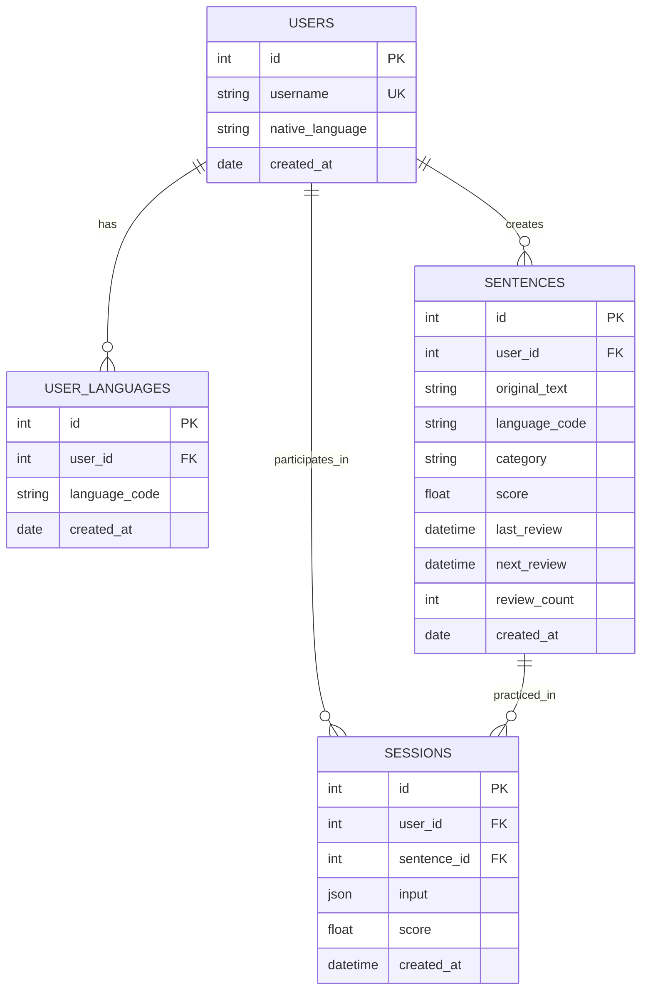

# N-LanguagesAI Simplified Database Schema

This document shows the proposed simplified database structure for the N-LanguagesAI multilingual learning application.

## Database Overview

The simplified database removes the complex group-based progress tracking and consolidates learning progress directly into the sentences table. A new sessions table tracks individual learning attempts with flexible JSON input storage.

## Simplified Entity Relationship Diagram



## Key Changes from Previous Schema

### Removed Tables
- **PROGRESS_GROUPS**: Eliminated complex group-based scheduling
- **LEARNING_PROGRESS**: Consolidated into SENTENCES table
- **TRANSLATIONS**: Removed separate translation storage

### Modified Tables

#### SENTENCES (Enhanced)
**New Columns Added:**
- `score` (float): Current learning score for this sentence
- `last_review` (datetime): When sentence was last reviewed
- `next_review` (datetime): When sentence should be reviewed next
- `review_count` (int): Number of times sentence has been reviewed

#### SESSIONS (New Table)
**Purpose**: Track individual learning sessions and attempts
**Columns:**
- `id` (int, PK): Unique session identifier
- `user_id` (int, FK): Reference to user
- `sentence_id` (int, FK): Reference to sentence being practiced
- `input` (json): Flexible storage for user inputs/answers in multiple languages
- `score` (float): Score achieved in this session
- `created_at` (datetime): When session occurred

## Simplified Design Benefits

### Reduced Complexity
- **Single Progress Tracking**: Progress stored directly in sentences table
- **Flexible Input Storage**: JSON field accommodates any input structure
- **Direct Relationships**: Cleaner foreign key relationships

### Session-Based Learning
- **Flexible Input**: JSON input field can store user answers in multiple languages
- **Historical Tracking**: All learning attempts preserved in sessions table
- **Performance Analytics**: Easy to calculate trends and improvements

### Spaced Repetition Simplified
- **Direct Scheduling**: Next review date stored directly in sentences
- **Score Tracking**: Current performance level in sentences table
- **Review History**: Count and timing tracked per sentence

## Example JSON Input Structure

The `input` field in SESSIONS can store flexible data like:

```json
{
  "target_languages": ["fr", "es", "it"],
  "user_answers": {
    "fr": "Je vais au travail",
    "es": "Voy al trabajo", 
    "it": "Vado al lavoro"
  },
  "correct_answers": {
    "fr": "Je vais au travail",
    "es": "Voy al trabajo",
    "it": "Vado al lavoro"
  },
  "language_scores": {
    "fr": 1.0,
    "es": 0.8,
    "it": 0.9
  }
}
```

## Data Flow (Simplified)
1. User creates account with native language
2. User adds target languages to learn
3. User inputs sentence with category → stored in SENTENCES
4. User practices sentence → SESSION created with JSON input/answers
5. System calculates score → updates SENTENCES progress fields
6. Next review scheduled based on performance → stored in SENTENCES.next_review

This simplified structure maintains the core learning functionality while significantly reducing database complexity and making the system easier to develop and maintain.